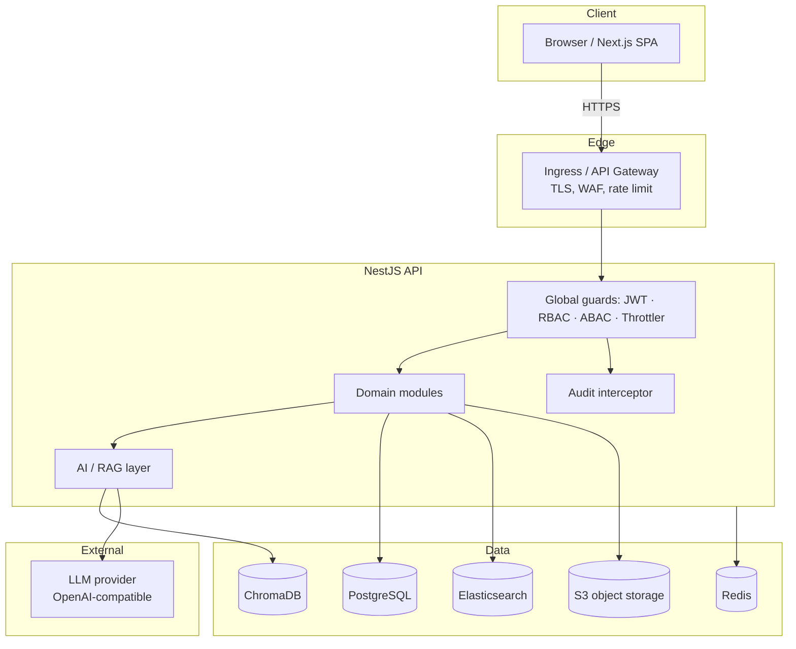
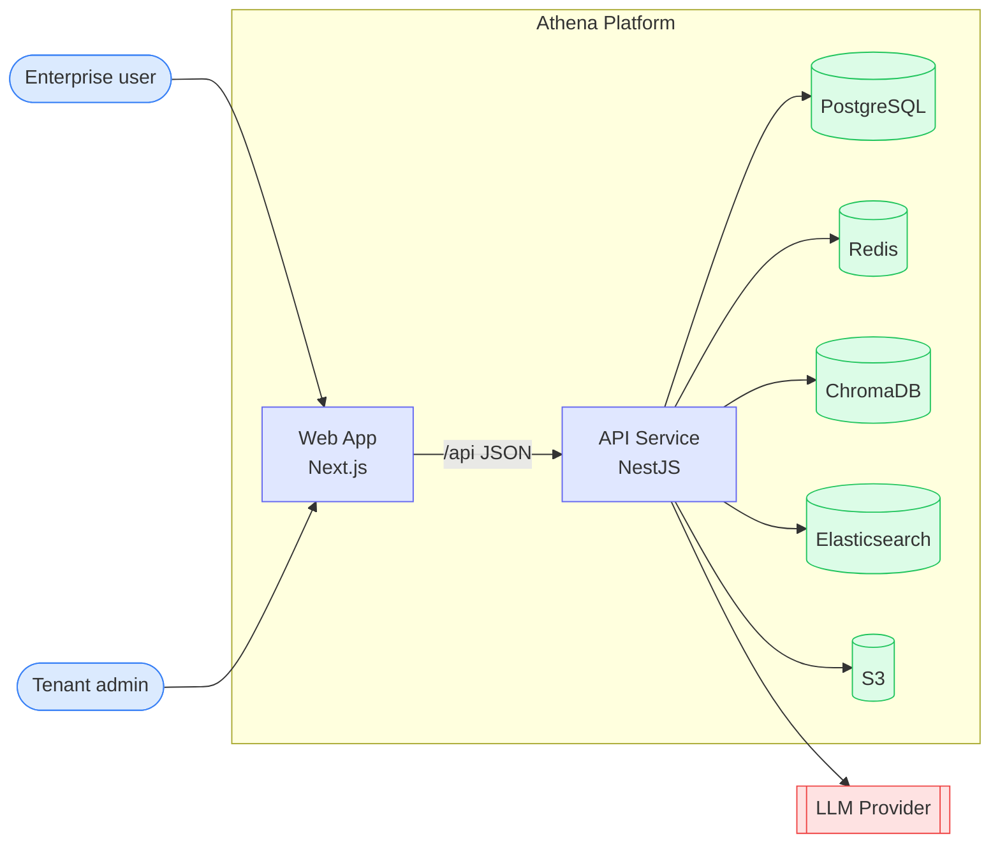
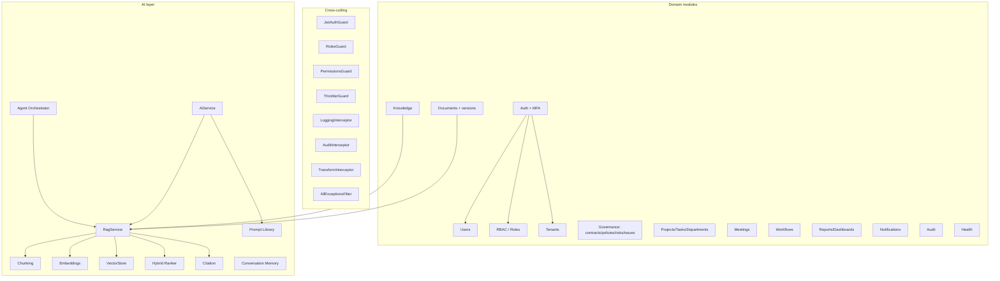
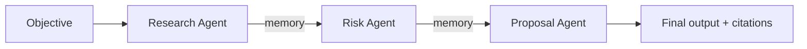
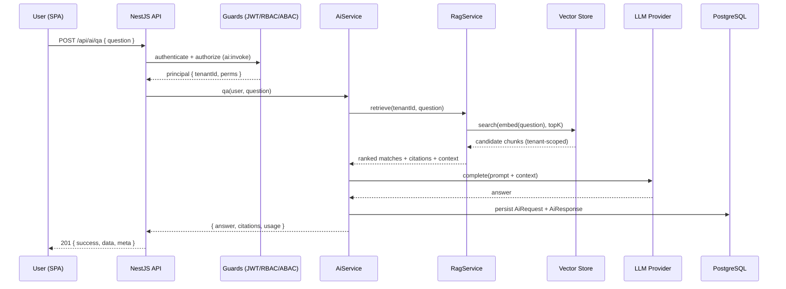
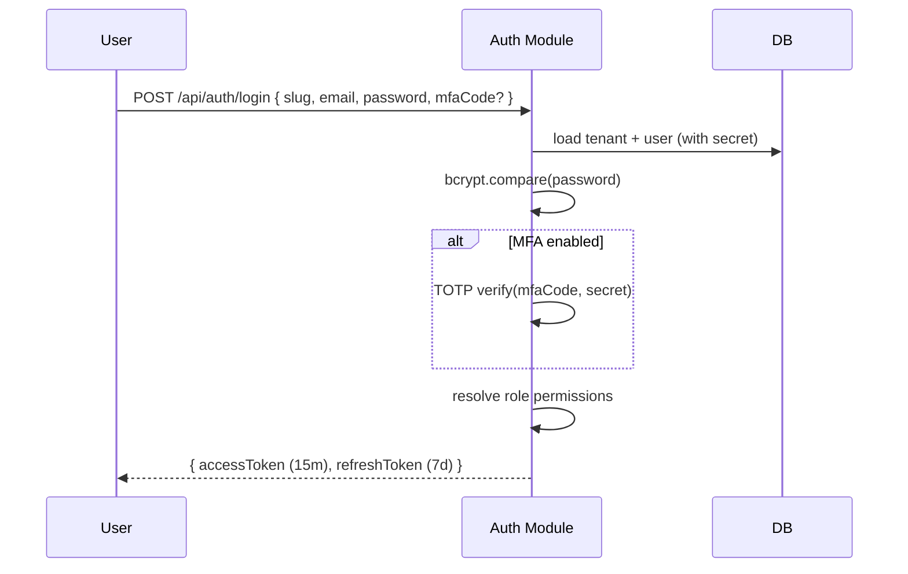
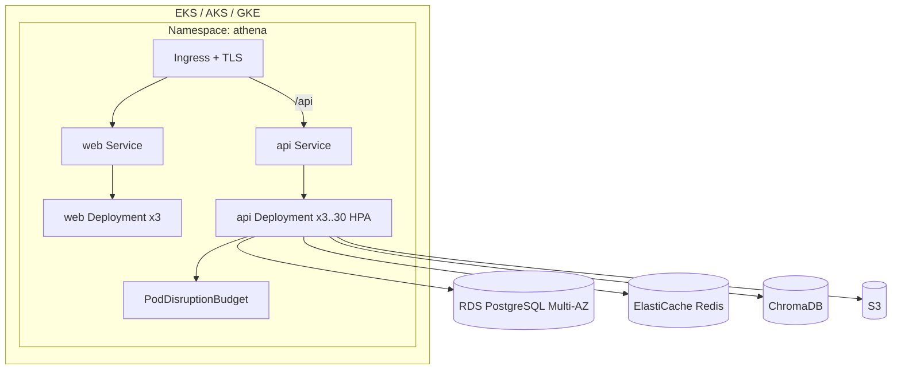

# Athena — Architecture

## 1. High-level overview

Athena is a **modular monolith, microservices-ready** platform. The Next.js web
tier talks to a NestJS API over a documented OpenAPI surface. The API enforces
authentication (JWT), authorization (RBAC + ABAC), tenant isolation and audit on
every request, and delegates AI work to a provider-pluggable AI/RAG layer.



## 2. C4 — Container diagram



## 3. C4 — Component diagram (API service)



## 4. AI / RAG architecture

The Retrieval-Augmented Generation pipeline is the platform's intelligence core.

```mermaid
flowchart LR
  subgraph Ingestion
    T[Source text\n(document/knowledge)] --> C[Chunking\nsentence-aware + overlap]
    C --> E1[Embedding provider]
    E1 --> U[Upsert → Vector store\n(tenant-scoped)]
  end
  subgraph Query
    Q[User query] --> E2[Embed query]
    E2 --> S[Vector search topK*3]
    S --> R[Hybrid re-rank\n0.7·dense + 0.3·lexical]
    R --> CT[Citation builder\nnumbered + context block]
    CT --> P[Prompt + context]
    P --> M[LLM provider]
    M --> A[Grounded answer + citations]
  end
```

**Provider abstraction** — selected at runtime via config:

| Concern    | Offline (default)              | Production                       |
| ---------- | ------------------------------ | -------------------------------- |
| LLM        | `MockLlmProvider` (NLP heuristics) | `OpenAiLlmProvider` (HTTP)   |
| Embeddings | `LocalEmbeddingProvider` (hashed BoW, L2-normalized) | `OpenAiEmbeddingProvider` |
| Vector store | `TypeOrmVectorStore` (DB + cosine) | ChromaDB adapter           |

### Multi-agent orchestration

Eight specialized agents (`research`, `architecture`, `compliance`, `proposal`,
`testing`, `documentation`, `risk`, `project`) extend a common `BaseAgent` that
grounds each step with RAG retrieval. The `AgentOrchestratorService` runs a
single agent or a **sequential pipeline** where each agent's output is written to
a shared memory scratchpad consumed by the next.



## 5. Sequence — RAG-grounded question answering



## 6. Sequence — Login with MFA



## 7. Multi-tenancy

Shared-schema, **row-level multi-tenancy**: every business entity carries a
`tenantId`; services scope all reads/writes by the authenticated principal's
tenant; cross-tenant access is impossible through the API. System roles are
seeded per tenant at registration. This model scales to 100k+ users while
keeping operational overhead low; the boundary is clean enough to migrate hot
tenants to dedicated schemas/databases later without API changes.

## 8. Deployment (Kubernetes)



Scalability features: stateless API pods, **HorizontalPodAutoscaler** (CPU 70%,
3→30 replicas), **PodDisruptionBudget**, rolling updates with `maxUnavailable:0`,
Redis-backed shared state, read-replica-ready data access, and CDN/edge caching
for the static SPA. Blue/green and canary strategies are described in
[`OPERATIONS.md`](OPERATIONS.md).

## 9. Cross-cutting concerns

- **AuthN**: JWT access/refresh via Passport; issuer-validated; MFA TOTP.
- **AuthZ**: global `RolesGuard` (RBAC) + `PermissionsGuard` (ABAC) with
  `SUPER_ADMIN` bypass and `@Public()`/`@Roles()`/`@RequirePermissions()`.
- **Audit**: global interceptor writes an append-only record for every mutation.
- **Validation**: global `ValidationPipe` (whitelist + transform) over DTOs.
- **Errors**: `AllExceptionsFilter` produces a stable error envelope.
- **Responses**: `TransformInterceptor` wraps success in `{ success, data, meta }`.
- **Tracing**: `x-request-id` correlation middleware on every request.
- **Rate limiting**: `ThrottlerGuard` globally + stricter on auth endpoints.
```
