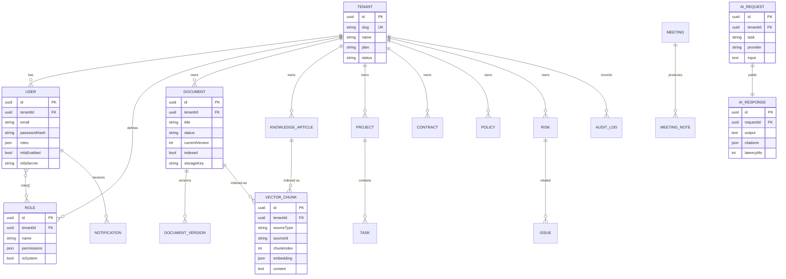

# Athena — Database Design

The schema is portable across **SQLite** (local/test) and **PostgreSQL**
(production): UUID primary keys, `simple-json` columns (no native JSON/array
types), string enums, explicit indexes, and `createdAt/updatedAt/version`
(optimistic locking) on every entity via `BaseEntity`.

## Entity-Relationship model

Full entity set (23 tables): `tenants`, `users`, `roles`, `documents`,
`document_versions`, `knowledge_articles`, `audit_logs`, `notifications`,
`ai_requests`, `ai_responses`, `vector_chunks`, `departments`, `projects`,
`tasks`, `meetings`, `meeting_notes`, `contracts`, `policies`, `risks`,
`issues`, `workflows`, `reports`, `dashboards`.

## Indexing strategy

| Table | Index | Purpose |
| ----- | ----- | ------- |
| `users` | unique `(tenantId, email)` | tenant-scoped identity, fast login |
| `roles` | unique `(tenantId, name)` | role resolution |
| `documents` | `(tenantId, status)`, `tenantId` | tenant lists & filtering |
| `document_versions` | unique `(documentId, version)` | version integrity |
| `vector_chunks` | `(tenantId, sourceType, sourceId)` | retrieval scoping & deletes |
| `audit_logs` | `(tenantId, createdAt)`, `(tenantId, action)` | time/action queries |
| `notifications` | `(tenantId, recipientId, read)` | inbox & unread counts |
| `ai_requests` | `(tenantId, task)` | usage analytics |

In production, `vector_chunks.embedding` moves to **ChromaDB** (HNSW ANN). If
keeping vectors in PostgreSQL at scale, use the **`pgvector`** extension with an
IVFFlat/HNSW index instead of the portable JSON+cosine fallback used here.

## Partitioning strategy (PostgreSQL)

- **`audit_logs`** and **`ai_requests`/`ai_responses`**: declarative **range
  partitioning by month** on `createdAt`. New partitions are created ahead of
  time (pg_partman); old partitions are detached for archival.
- **Very large tenants**: optional **hash partitioning by `tenantId`** for
  `documents`, `vector_chunks` to bound per-partition size and improve locality.
- Hot/large tenants can be promoted to a **dedicated schema or database** while
  preserving the row-level model and API contract.

## Archival strategy

- Audit and AI tables are append-only; partitions older than the retention
  window (default 13 months audit, 6 months AI I/O) are exported to **S3 as
  Parquet** and dropped from the OLTP store.
- Documents set to `archived` keep metadata online but move blob content to an
  **S3 infrequent-access / Glacier** tier via lifecycle policy.
- Knowledge articles use soft state (`archived`) and remain queryable.

## Backup & recovery

- **PostgreSQL**: automated daily snapshots + **PITR** via WAL archiving to S3.
  Targets: **RPO ≤ 5 min**, **RTO ≤ 1 hr**. Multi-AZ for automatic failover.
- **S3**: versioning + cross-region replication for documents.
- **ChromaDB**: periodic volume snapshots; the relational `vector_chunks`
  metadata enables full re-embedding/rebuild if the ANN index is lost.
- **Restore drills**: quarterly, validated against a staging restore (see
  [`OPERATIONS.md`](OPERATIONS.md) DR runbook).

## Migrations

Local/dev use TypeORM `synchronize`. Production disables it (`DB_SYNC=false`)
and applies versioned TypeORM migrations in a pre-deploy job so schema changes
are reviewed, reversible and decoupled from rollout.
